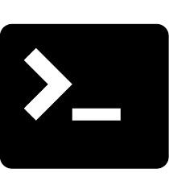
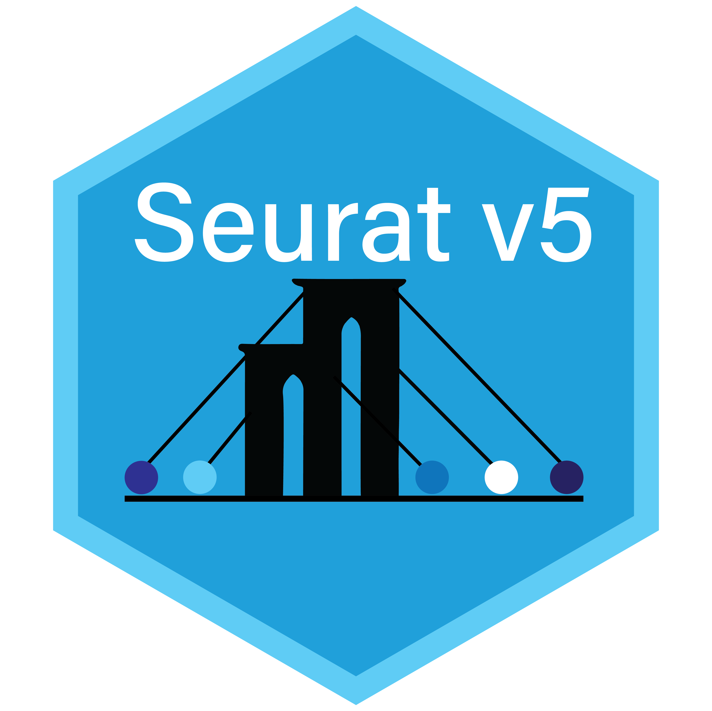
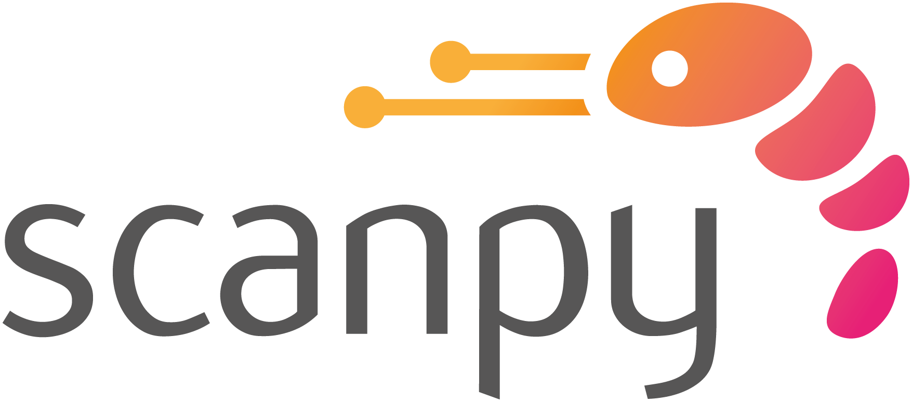
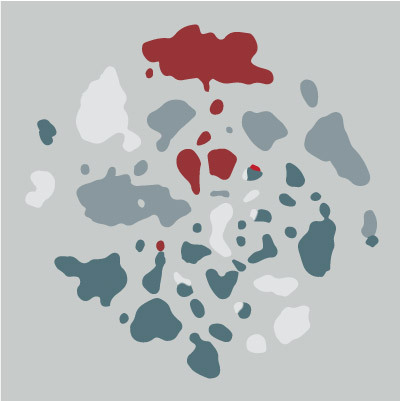

Looking to learn scRNAseq analysis or another bioinformatic analysis? Here are some places to get started!

## General Coding 
Bioinformatics, of any kind, will require some base knowledge of coding. Here are some resources for commonly used tools. 

 An introduction to [R](https://stat545.com/) with focus on statistics

  A guide for [python](https://pythonforbiologists.com/)

 An introduction to [Command line](http://korflab.ucdavis.edu/bootcamp.html)

## Single-Cell Transcriptomics Specific

 If your preference is coding in R, I would recommend starting with [Seurat](https://satijalab.org/seurat/articles/get_started_v5_new) as the tutorials are very good. 

 If your preference is coding in python, [scanpy](https://scanpy.readthedocs.io/en/stable/index.html) is  excellent and has great tutorials as well. 

## Courses and Workshops
 [Canadian Bioinformatics Workshops](https://bioinformatics.ca/workshops/current-workshops/) are available on a variety of topics with one course specifically on single-cell transcriptomics

 Applications currently open for [Single Cell RNA-seq Analysis](https://bioinformatics.ca/workshops-all/2024-single-cell-rna-seq-analysis/)
